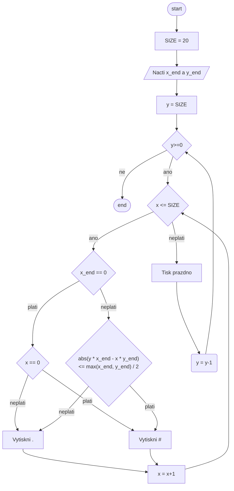

```mermaid
flowchart TD
    start([start]) -->VariableSize[SIZE = 20] -->NacistVektor[/Nacti x_end a y_end/]--> YJeSize[y = SIZE] --> HlavniCyklus{y>=0} 
    HlavniCyklus -- ne --> konec([end])
    HlavniCyklus -- ano --> Cyklus2{x <= SIZE} -- ano --> podminkax_end{x_end == 0} -- plati --> XjeRovnaNule{x == 0} -- plati --> Vytiskni#[Vytiskni #]
    XjeRovnaNule -- neplati --> Vytiskni.[Vytiskni .]
    podminkax_end -- neplati --> Vektor{"abs(y * x_end - x * y_end) 
    <= max(x_end, y_end) / 2"} -- plati --> Vytiskni#
    Vektor -- neplati --> Vytiskni. --> xRust[x = x+1]
    Vytiskni# --> xRust --> Cyklus2
    Cyklus2 -- neplati --> tiskPrazdno[Tisk prazdno] -->SnizeniY(y = y-1) -->HlavniCyklus
```