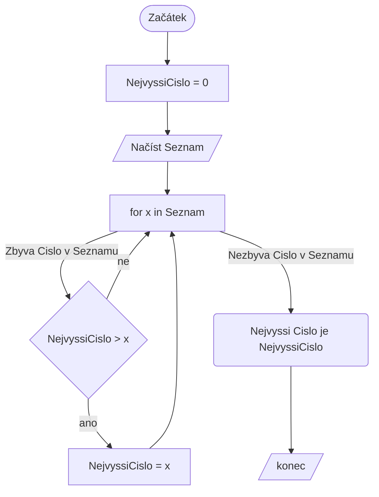

```mermaid
flowchart TD
    start([Začátek]) --> NejvyssiCislo[NejvyssiCislo = 0]
    NejvyssiCislo --> input[/Načíst Seznam/]
    input --> cycle[for x in Seznam]
    cycle --Zbyva Cislo v Seznamu--> podminka{NejvyssiCislo > x }
    podminka -- ne --> cycle
    podminka -- ano --> NoveNejvyssiCislo[NejvyssiCislo = x]
    NoveNejvyssiCislo --> cycle
    cycle -- Nezbyva Cislo v Seznamu --> FinalniCislo(Nejvyssi Cislo je NejvyssiCislo) 
    FinalniCislo --> konec[/konec/]
```